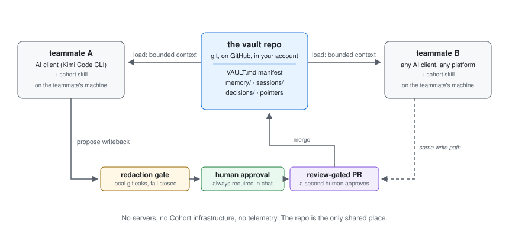

# Cohort

> Shared context for AI chatbots. One markdown vault on GitHub. Every teammate's AI, regardless of account, plan, or platform, reads and writes the same memory.



---

## What it is

Cohort gives a team shared memory for their AI chatbots. One git repository holds the team's facts, decisions, and open threads in plain markdown. Each teammate's AI reads a bounded slice at session start and proposes updates at session end, and a human approves every change before it lands. There are no servers and no accounts with us: the repo is the product, and it lives in your GitHub.

## Current status (v0.3.0, October 2026)

Works today:

- Install in under a minute: run one terminal command, or upload the skill zip in your client's skill settings. Both are on this page.
- Conversational setup: the skill walks you through GitHub sign-in, vault creation (it creates the repo, or links one you made in your browser), and three consent choices.
- Team memory load at session start, human-approved writebacks at session end, through review-gated pull requests.
- Local secret scanning that blocks API keys, tokens, and private data before every commit.
- Kimi connector for Kimi Code CLI and Kimi Work desktop; ZCode connector for the ZCode client.

Not yet:

- Connectors for Claude and GPT (the vault format is client-neutral; only Kimi and ZCode ship today).
- Google Drive as a storage option (git/GitHub is the only transport for now).
- A public launch announcement.

## How to start

### Which client is this for?

Cohort runs inside an AI client that can access your disk and git.

| Client | Works with Cohort? |
|---|---|
| Kimi Code CLI (the terminal coding tool) | Yes, full setup and daily use. This guide walks Kimi and ZCode below. |
| Kimi Work desktop | Yes. Attach your vault folder as the workspace, then follow the same steps. |
| ZCode (the coding client) | Yes, full setup and daily use. Same vault, same steps, except where the client is named. |
| Kimi Chat (web or app) and other chats without disk access | No. They cannot access your disk or git, so install commands will not run there. A teammate can export vault files and add them to a chat project as read-only reference, with no sync back. |

If you are reading this in a web chat and want the real thing, install a desktop client first (Kimi Code CLI or ZCode), then start from the top.

**How you start it:**

| Client | How you start the Cohort skill |
|---|---|
| Kimi Code CLI | Type `/skill:cohort` in the chat input, or just ask in plain language ("set up my team vault") and the model loads it for you. |
| Kimi Work desktop | Type `/` in the chat input and pick Cohort from the Skills menu, or describe the task in plain language and Kimi Agent triggers it. |
| ZCode | Type `/cohort` in the chat input, or just ask in plain language ("set up my team vault") and the model loads it for you. |

### Everyone

What you need before you begin: a GitHub account (free), a client with the Cohort connector installed (Kimi Code CLI or ZCode), and about five minutes. Nothing else. No Cohort account exists and none is needed.

**Step 1. Open a terminal.**

- Windows: open the terminal inside your client (Kimi Code CLI or ZCode), or open Git Bash (it installs with Git).
- Mac: open the Terminal app (press Cmd+Space, type Terminal).
- Linux: open your terminal app.

**Step 2. Paste this one line and press Enter:**

```sh
curl -fsSL https://raw.githubusercontent.com/magnusmage/cohort/v0.3.0/install.sh | sh
```

The installer checks that the file matches the official v0.3.0 release exactly, then copies the connector skills onto your machine: one per client, each into its own skill folder, each verified against its checksum. When it finishes you will see:

```
installed cohort skill to <your home>/.kimi-code/skills/cohort
next: start Kimi Code CLI and run /skill:cohort, then say "set up my team vault"
installed cohort skill to <your home>/.zcode/skills/cohort
next: start ZCode and run /cohort, then say "set up my team vault"
```

A release that predates a connector skips it with a notice, and each client reads only its own folder, so an extra copy is harmless. The ZCode connector ships from the release that follows v0.3.0; until that tag is cut, install it with the manual copy in the Developers section below.

Prefer to read installer scripts first? Run `curl -fsSLO .../install.sh`, read the file, then `sh install.sh`. Same result.

No `curl` or `sh` available? Download the skill zip from the [v0.3.0 release](https://github.com/magnusmage/cohort/releases/tag/v0.3.0), unzip it, and upload the `cohort` folder in your client's skill settings. Download the skill zip under Assets, not Source code; only the skill zip unpacks to a ready skill folder.

If Step 2 fails: on Windows the usual cause is no curl or no sh outside your client's terminal, so use the terminal inside your client. Otherwise copy the full error message into your chat and ask what to do. Do not retry blindly.

**Step 3 (optional, ten seconds). Check it landed:**

```sh
ls ~/.kimi-code/skills/cohort   # Kimi
ls ~/.zcode/skills/cohort       # ZCode
```

Files listed means the skill is installed for your user, so every project on this machine can use it (this is "user scope"). To install for one project only, use the Developers path below.

**Step 4. Start your client in any project folder.** In the chat input, not the terminal: Kimi Code CLI, type `/skill:cohort`; ZCode, type `/cohort`. Then send the message "set up my team vault".

**Step 5. Answer the connector's questions in chat.** It first tells you exactly what it does with your data and waits for your yes. Then it walks you through GitHub sign-in (a browser window, preferred; a fine-grained token only if the browser flow cannot run) and creating your vault repo. You can let the connector create the repo, or create an empty private repo yourself at github.com/new (no README, no license) and paste its link. Then it asks three consent choices, each explained in one sentence before you decide: when it loads context, when it proposes updates, and what content it reads. Every step waits for you.

When it finishes, it tells you to start your next session with the vault folder as the project directory. That folder is your team's memory from then on.

### Developers

```sh
git clone https://github.com/magnusmage/cohort.git   # the tooling and spec
sh cohort/scripts/setup.sh                           # seeds a vault, asks consent, installs the redaction hook
cp -R cohort/connectors/kimi ~/.kimi-code/skills/cohort   # installs the Kimi connector
cp -R cohort/connectors/zcode ~/.zcode/skills/cohort      # installs the ZCode connector
gh auth login                                        # GitHub auth for repo creation and PRs
```

### Daily use

| You want | You do |
|---|---|
| Team context at session start | Type `/skill:cohort` in Kimi Code CLI, `/cohort` in ZCode, pick Cohort from the `/` menu in Kimi Work desktop, or ask "load team context" (with project scope chosen at setup it auto-loads) |
| Save a decision, fact, or open thread | Ask the connector to propose a writeback; edit and approve the draft |
| Add a teammate | Add them as a GitHub collaborator on the vault repo. That is the entire sharing mechanism |

## Where to read more

- [Cohort, explained](docs/EXPLAINED.md): the loop, every command, the consent choices, the security model in one page
- [The spec](docs/TECHNICAL.md): architecture, vault schema, connector contract
- [The security model](docs/SECURITY.md): threat model, redaction rules, consent model
- [Ten-minute walkthrough](docs/QUICKSTART.md)
- [Who it is for](docs/USE-CASES.md) and [honest limits](docs/LIMITATIONS.md)
- [Decision records](docs/decisions/) and [release history](CHANGELOG.md)

## Repository layout

```
├── connectors/kimi/     The Kimi connector (SKILL.md, Agent Skills standard)
├── connectors/zcode/    The ZCode connector (SKILL.md, Agent Skills standard)
├── vault-template/      Blank vault scaffold (copied into your own repo)
├── example-vault/       Synthetic demo vault (CC0, all content fictional)
├── scripts/             Setup wizard and vault validator
├── security/            Versioned gitleaks redaction rules
├── install.sh           Pinned-tag installer for the connector skill
└── docs/                The public spec, decision records, the diagram
```

## Contributing

See [CONTRIBUTING.md](CONTRIBUTING.md). Commits use Conventional Commits and
DCO sign-off (`git commit -s`). Security issues: please report privately via
GitHub private vulnerability reporting, not public issues.

## License and authorship

Apache-2.0 for code, CC BY 4.0 for docs, CC0 for example vault content.
Created and maintained by [Sarmad](https://github.com/evdatsion). See
[CITATION.cff](CITATION.cff) for citation metadata.
